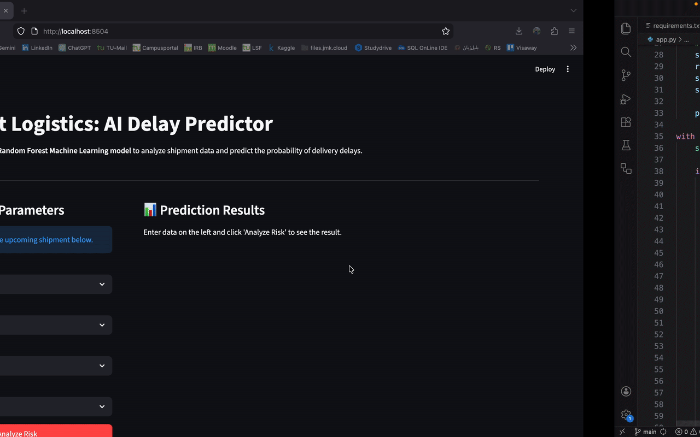
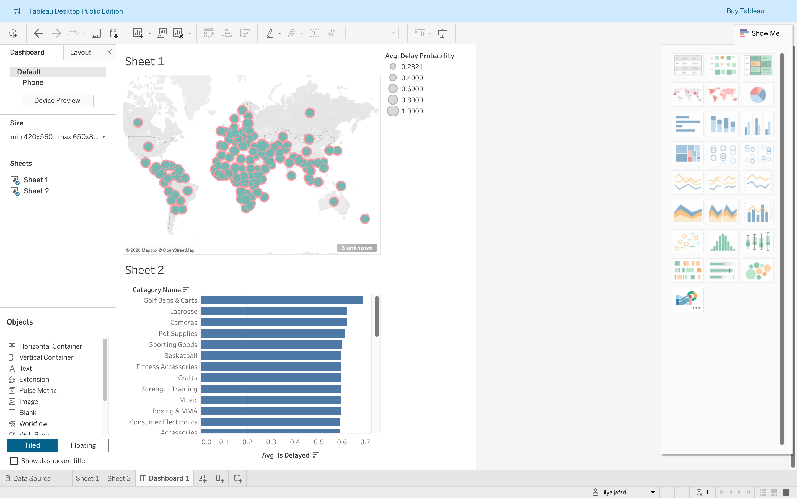

# 🚚 Smart Logistics: Supply Chain Delay Prediction & AI Dashboard

## 📌 Project Overview
In global logistics, shipping delays cause significant financial loss. This project provides an **end-to-end data science solution** to predict and visualize delivery risks.

I combined **Machine Learning (Python)** with **Business Intelligence (Tableau)** to create a tool that:
1. Analyzes historical shipping data to find patterns.
2. Uses a **Random Forest AI model** to predict the probability of future delays.
3. Visualizes global risk zones in an interactive dashboard.

---
---
## 📊 Interactive Dashboard

You can view the live, interactive Tableau dashboard here:
👉 **[https://public.tableau.com/views/Logistik-analysist/Dashboard1?:language=de-DE&publish=yes&:sid=&:redirect=auth&:display_count=n&:origin=viz_share_link)]

---

## 🛠 Tech Stack
- **Language:** Python 3.12 (on macOS)
- **Machine Learning:** Scikit-Learn (Random Forest)
- **Data Manipulation:** Pandas, NumPy
- **Visualization:** Tableau Public
- **Environment:** VS Code (Jupyter Notebooks)

---

## 📈 Key Insights & Results
- **AI Prediction:** The model assigns a `Delay_Probability` score to every order, helping managers act before a delay happens.
- **Global Risk Map:** Countries like [Insert a Country with high delay from your map] show higher delay risks.
- **Product Analysis:** Certain product categories have a significantly higher delay rate than others.

---

## 📁 Repository Structure
- `analysis.ipynb`: The full Python workflow (Cleaning, EDA, ML).
- `logistics_for_tableau.csv`: The processed dataset used for the dashboard.
- `requirements.txt`: List of Python libraries needed.
- `README.md`: Project documentation.

---

## 🚀 How to Run
1. Clone the repo: `git clone https://github.com/YOUR_USERNAME/your-repo-name.git`
2. Install dependencies: `pip install -r requirements.txt`
3. Run `analysis.ipynb` in VS Code.